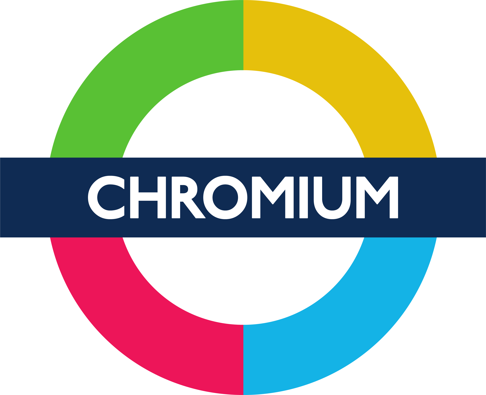

# Chromium 

[![Snakemake][shield-snakemake]](https://snakemake.readthedocs.io)

Table of Contents
-----------------

  * [Introduction](#introduction)
  * [Requirements](#requirements)
  * [Usage](#usage)
  * [Configuration](#configuration)
  * [Contributing](#contributing)
  * [Support and Migration](#support-and-migration)
  * [License](#license)

Introduction
------------

Chromium is a Snakemake workflow for the analysis of single-cell RNA-seq data (scRNA-seq)


Overview
--------

The Chromium workflow is divided into multiple sub-workflows:

1. Droplet processing (DropletUtils)
2. Quality control (scuttle)
3. Normalization (scran)
4. Feature selection (scran)
5. Integrating Datasets (Optional)
6. Dimensionality reduction (scater)
7. Clustering (bluster)
8. Doublet detection (scDblFinder)
9. Stripped detection
10. Cell cycle assignment (scran)
11. Marker gene detection (scran)
12. Trajectory analysis (TSCAN, slingshot)
13. Cell type annotation
14. Interactive data exploration (iSEE)
15. Report generation

Requirements
------------

Chromium requires the following to run:

  * [Snakemake][snakemake]


Usage
-----

Clone workflow into working directory:

```sh
git clone https://github.com/jma1991/chromium.git path/to/workdir
cd path/to/workdir
```

Edit config as needed:

```sh
vim config/config.yaml
```

Execute workflow, deploy software dependencies via conda

```sh
snakemake -n --use-conda
```

Configuration
-------------

Chromium is configured by editing the config.yaml file.

Contributing
------------

To contribute to Chromium, clone this repository locally and commit your code on a separate branch. Please write unit tests for your code, and run the linter before opening a pull-request:

```sh
snakemake --generate-unit-tests  # run all unit tests
snakemake --lint                 # run the linter
```

You can find more detail in our [Contributing](CONTRIBUTING.md) guide. Participation in this open source project is subject to a [Code of Conduct](CODE_OF_CONDUCT.md).

Support and Migration
---------------------


Thanks
------

I would like to thank the developers of the Orchestrating Single-Cell Analysis with Bioconductor


License
-------

Chromium is licensed under the [MIT](LICENSE.md) license.  
Copyright &copy; 2021, James Ashmore


[snakemake]: https://snakemake.readthedocs.io/en/stable/
[shield-snakemake]: https://img.shields.io/badge/snakemake-brightgreen.svg
